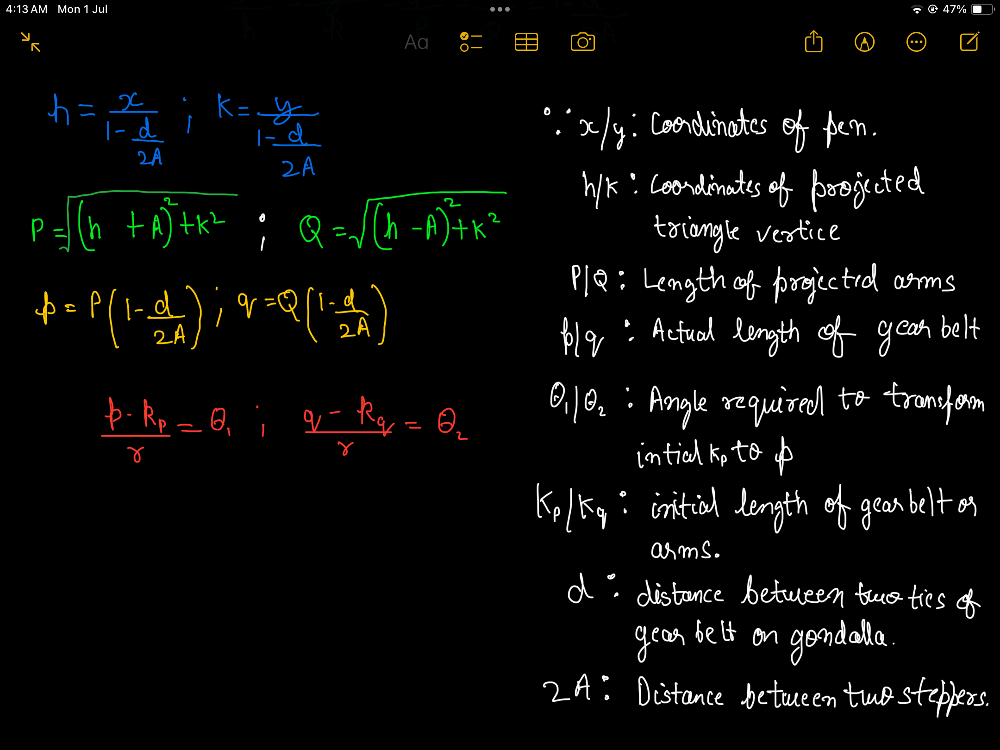

"# 2dPlotter" 

Derviation of formulas to find the cumilative angle for stepper motor used in the arduino code using reverse kinematics.
(Its just some basics distance formulas and similar trianles stuff.)
It just serves the purpose of taking in coordinates of where to move to, and outputs the angles required for stepper motor.
**Its not change in angle, but total angle from the time when the arduino is first initialized (at 0), and at that point, lenths of gear belt from stepper to gondalla is inputted into formulas.
(Check the attached pdf for my derivation and diagrams)
